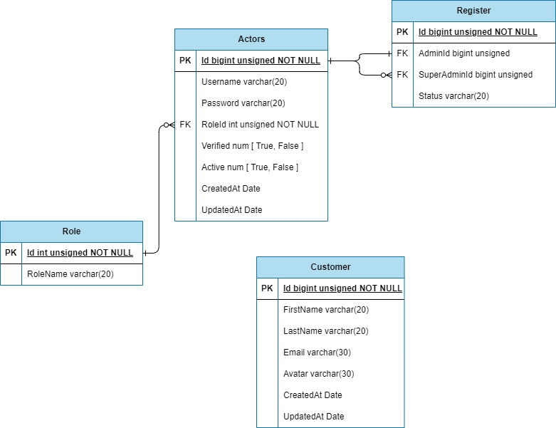

# Mini Project CRM Service

Proyek Mini Project CRM Service adalah aplikasi berbasis web yang dirancang untuk membantu perusahaan dalam mengelola hubungan pelanggan (Customer Relationship Management/CRM) mereka. Aplikasi ini bertujuan untuk membantu perusahaan dalam memantau, mengelola, dan meningkatkan interaksi dengan pelanggan. Aplikasi ini dibuat sebagai latihan dari program Intership BRI.

## Database

## End point

| Path       | Method | Request                                             | Result |
| ---------- | ------ | --------------------------------------------------- | ------ |
| /customers | POST   | Header "Bearer tokenJWT" Body "message": "Success", |

    "data": {
        "id": 29,
        "email": "king@mail.com",
        "last_name": "joerss emai",
        "avatar": "img.png",
        "first_name": "Doe"
    } |

    "message": "Success",
    "data": {
        "id": 29,
        "email": "king@mail.com",
        "last_name": "joerss emai",
        "avatar": "img.png",
        "first_name": "Doe"
    }

} |

     | {

"message": "Success",
"data": {
"id": 29,
"email": "king@mail.com",
"last_name": "joerss emai",
"avatar": "img.png",
"first_name": "Doe"
}
} |
